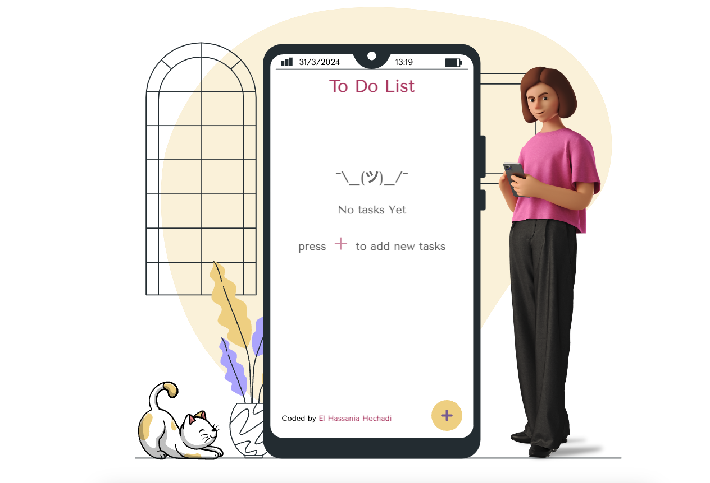

# Task Manager Web Application

This is a simple web application for managing tasks. Users can add, edit, delete, and mark tasks as completed. The application also allows users to view the details of each task in a modal window.

## Features

- Add new tasks with titles and details.
- Edit existing tasks.
- Delete tasks.
- Mark tasks as completed.
- View task details in a modal window.
- Local storage integration for data persistence.
- Responsive design for use on various devices.

## Technologies Used

- HTML
- CSS
- JavaScript

## Getting Started

1. Clone the repository to your local machine.
2. Open the `index.html` file in your web browser.

## Usage

- Click on the "Add Task" button to add a new task.
- Fill in the task title and details in the form.
- Click "Submit" to save the task.
- To edit a task, click on the edit button on the task card.
- To delete a task, click on the delete button on the task card.
- To mark a task as completed, click on the checkbox icon on the task card.
- Click on a task card to view its details in a modal window.

## Contributing

Contributions are welcome! Please fork the repository and submit a pull request with your changes.

